# ERD diagrams

## 1. User service (Teacher, Staff, Children Service)

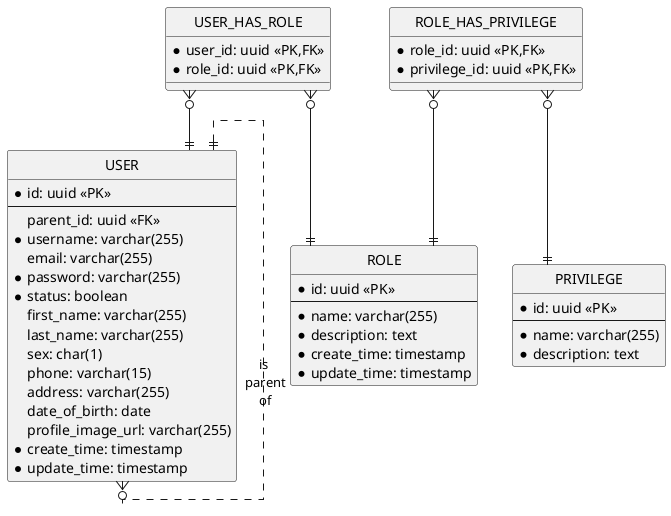

## 3. Art service

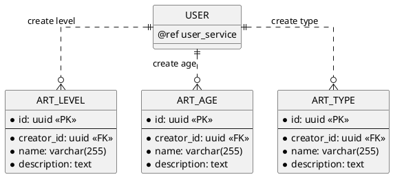

## 4. Contest service

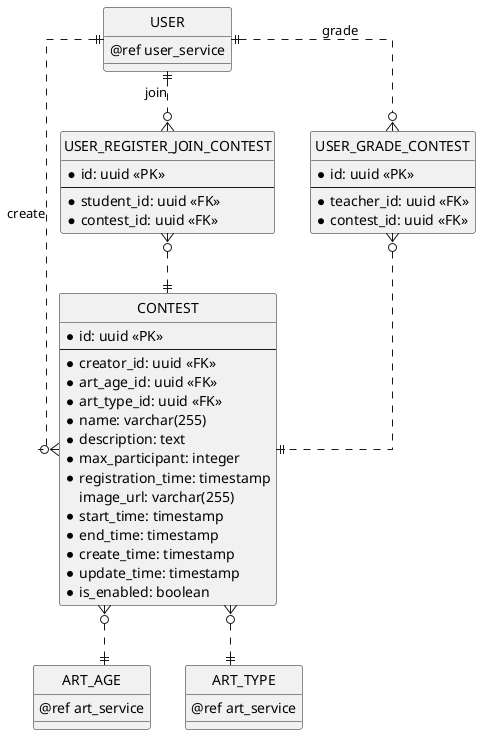

## 5. Course service

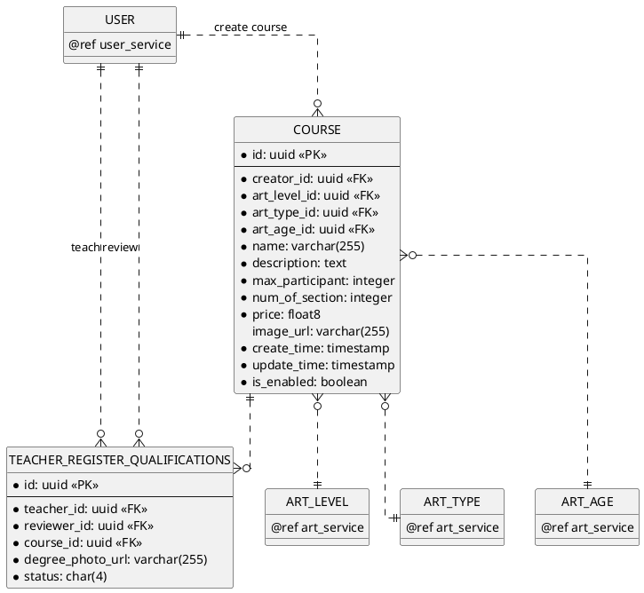

## 6. Schedule service

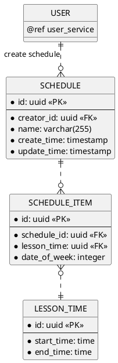

## 7. Semester service

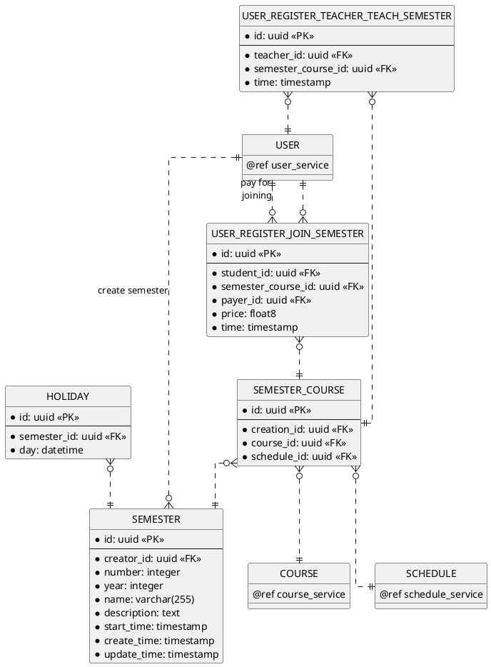

## 8. Class service

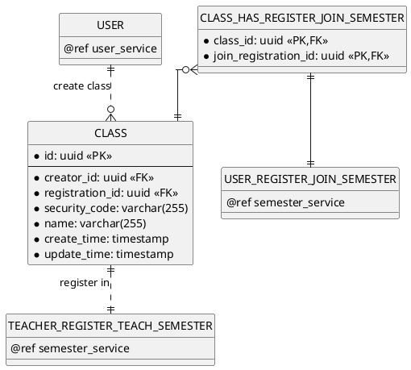

## 9. Section service

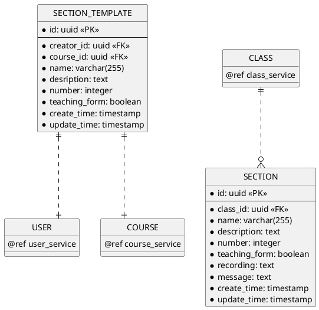

## 10. User Leave Section
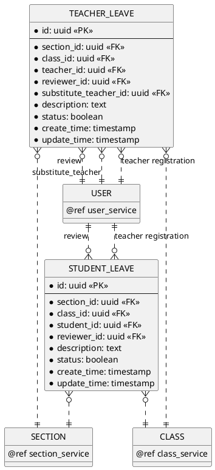

## 10. Exercise service

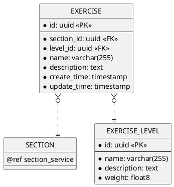

## 11. Tutorial service

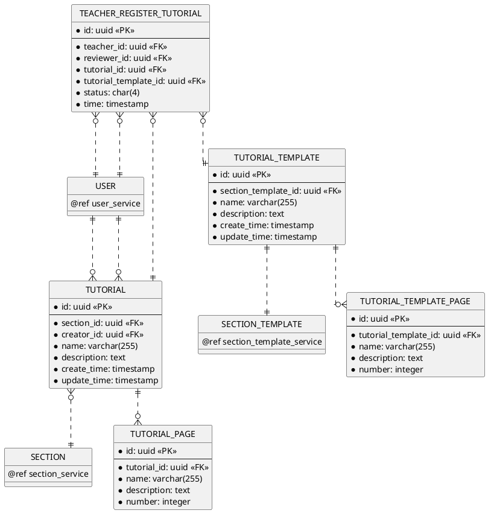

## 12. Submission service

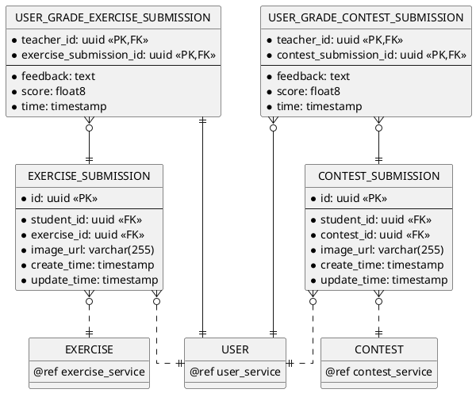

## 13. Notification service

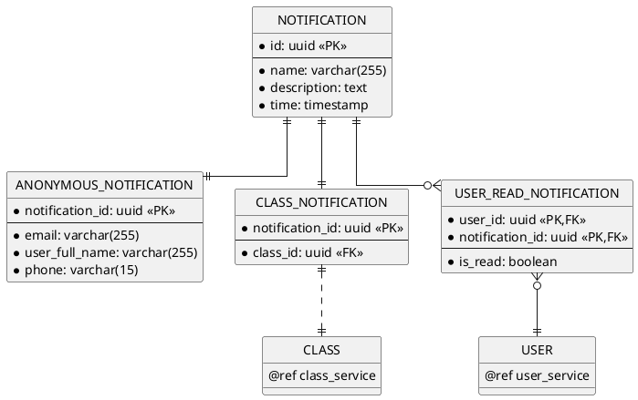
