# Usecase diagrams

## 0. User Hierarchy

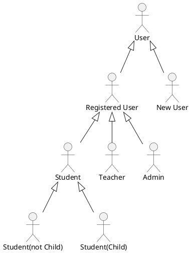

## 1. User service

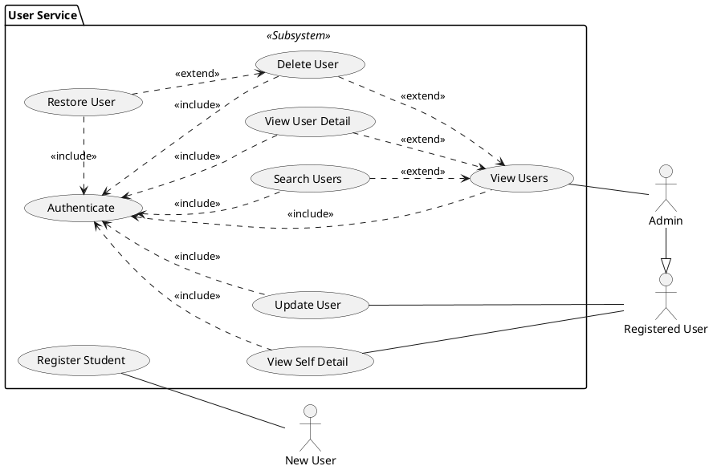

## 2. Teacher service

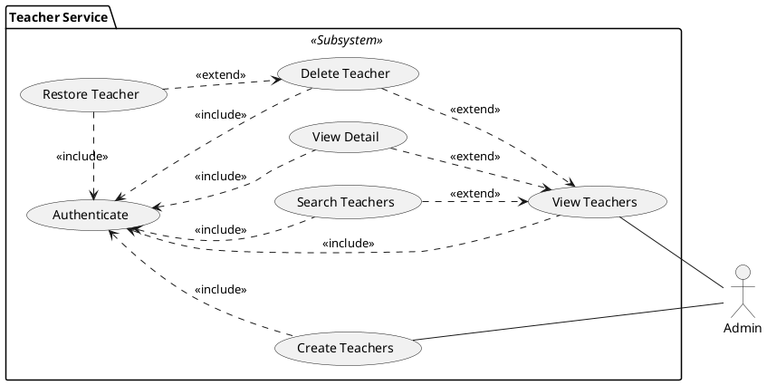

## 3. Children service

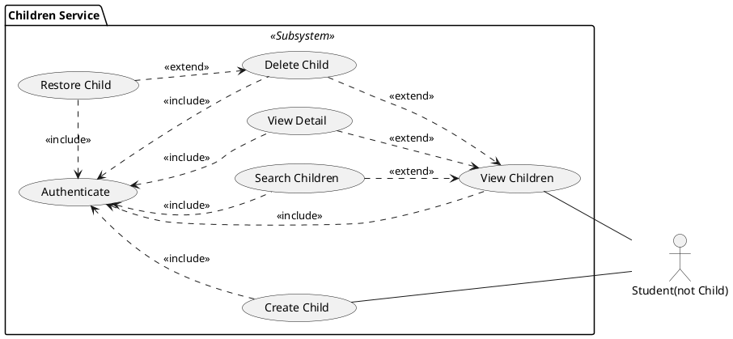

## 5. Art service

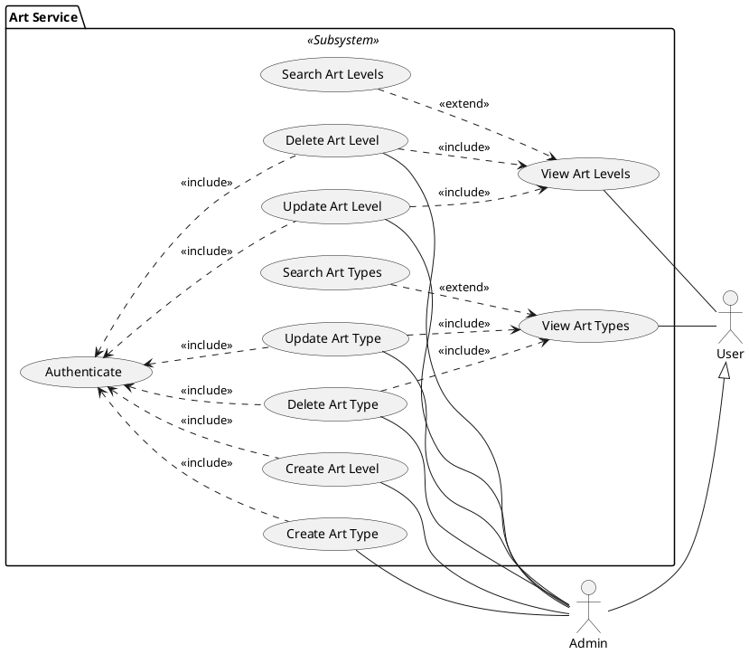

## 6. Contest service

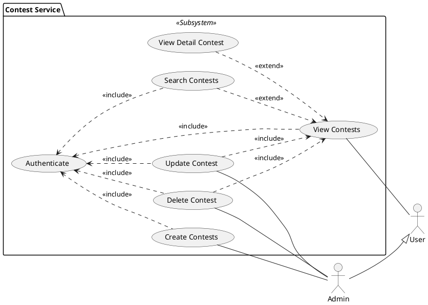

## 7. Course service

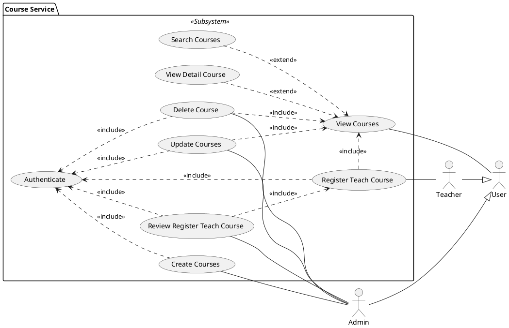

## 8. Schedule service

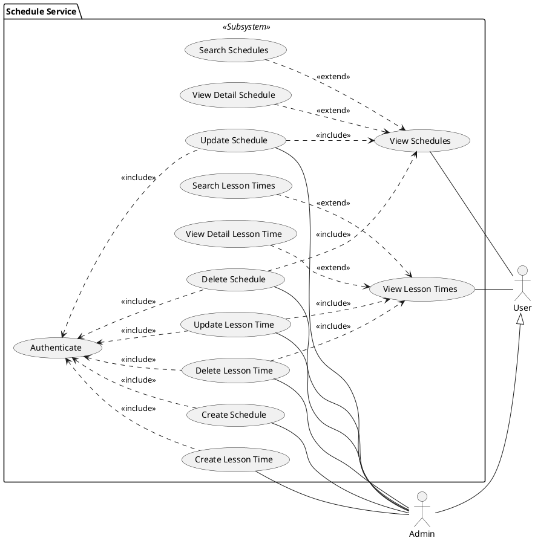

## 9. Semester service

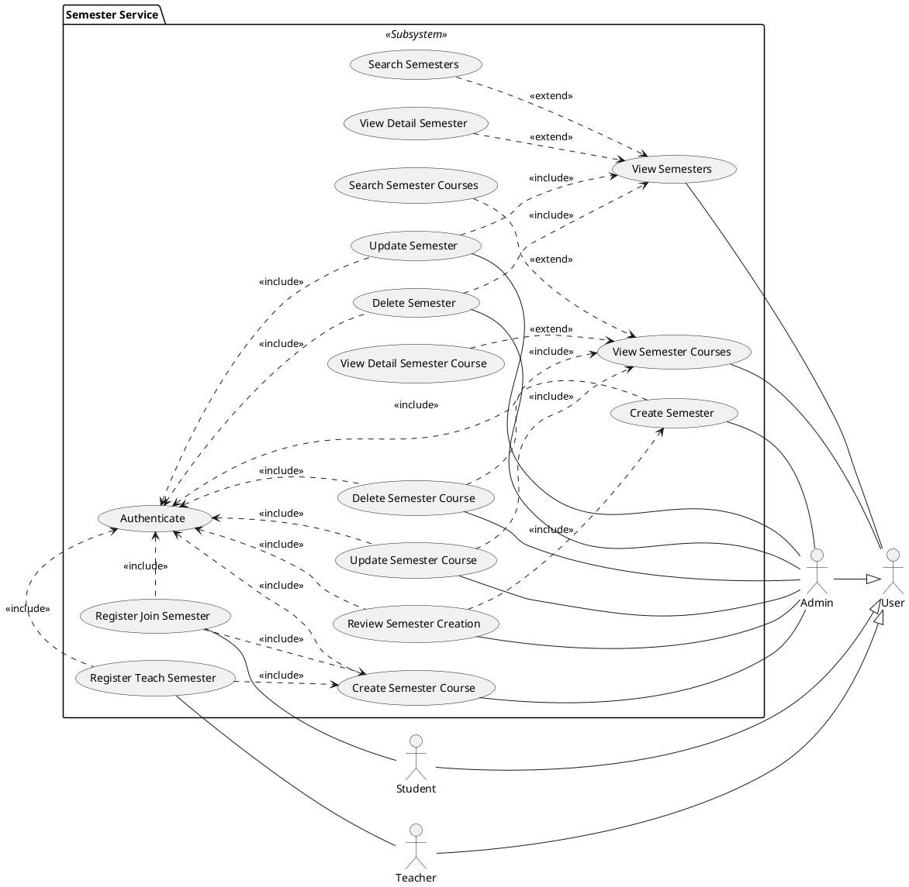

## 10. Class service

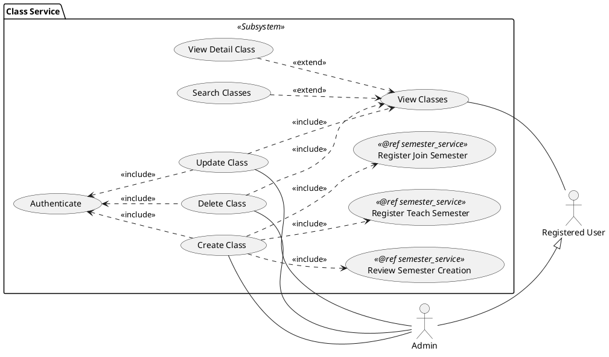

## 11. Section service

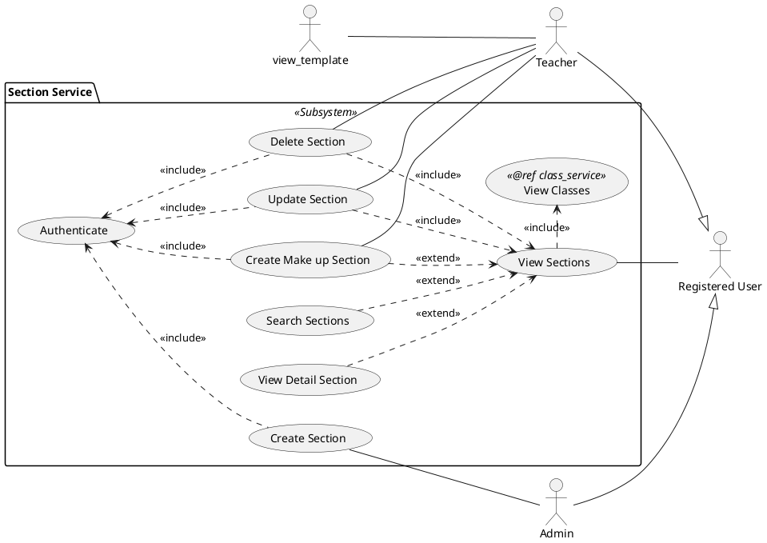
## 12. Blog service
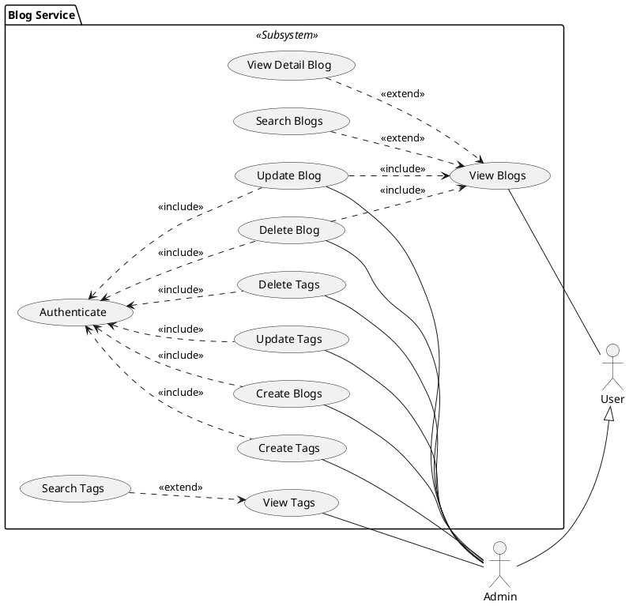

## 13. Exercise service
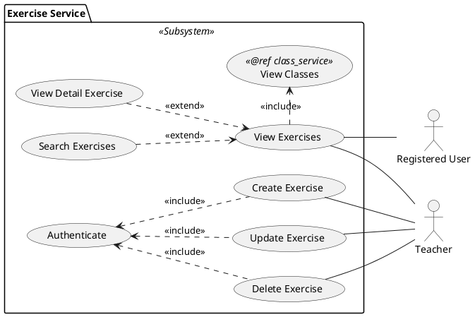

## 15. Tutorial service
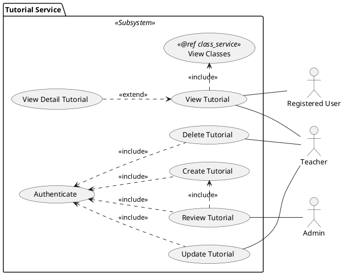

## 16. Submission service

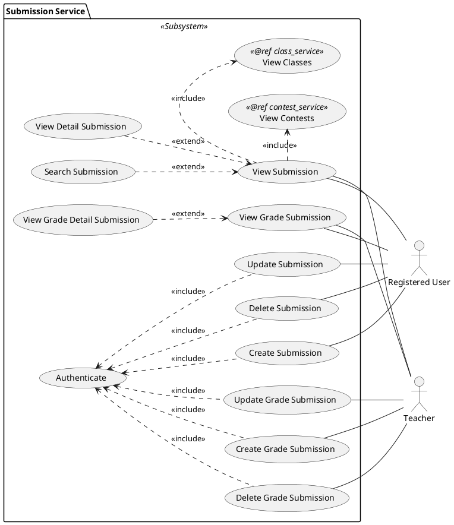

## 17. Notification service

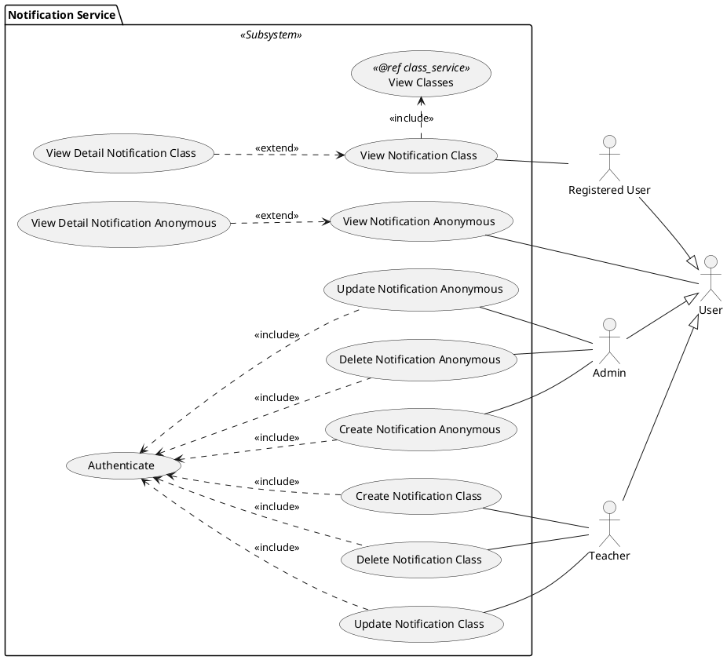
